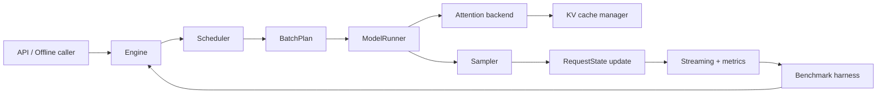

# nano-serve

English | [中文](README.zh.md)

`nano-serve` is a learning-oriented LLM serving engine. The goal is to start
from naive PyTorch forwarding, then add modern inference-engine features one by
one: KV cache, batching, paged attention, chunked prefill, prefix cache,
speculative decoding, TileLang kernels, distributed serving, PD disaggregation,
and eventually Attention-FFN disaggregation.

This repository is intentionally benchmark-first. Every feature should answer:

- What bottleneck does it target?
- Which workload benefits?
- Which workload gets worse?
- What changes in TTFT, TPOT, E2E latency, throughput, MFU, SM activity, HBM
  bandwidth, and KV memory usage?

## Current Status

This repository has been initialized as an agent-friendly project skeleton.
Most modules are interfaces, stubs, and design documents. Implementation should
follow the roadmap below, not jump directly into complex kernels or distributed
serving.

## Model and Dataset Assets

The first milestone supports exactly one model: `Qwen/Qwen3.5-4B`.

Large model and benchmark files must stay out of git. Point the project to local
asset paths with environment variables:

```bash
export NANO_SERVE_MODEL_PATH=$PWD/.nano-serve/models/qwen3.5-4b
export NANO_SERVE_DATASET_PATH=$PWD/.nano-serve/datasets/sharegpt/ShareGPT_V3_unfiltered_cleaned_split.json
```

Optional overrides:

```bash
export NANO_SERVE_MODEL_ID=Qwen/Qwen3.5-4B
export NANO_SERVE_DATASET_REPO_ID=anon8231489123/ShareGPT_Vicuna_unfiltered
export NANO_SERVE_DATASET_FILENAME=ShareGPT_V3_unfiltered_cleaned_split.json
```

Download the assets:

```bash
PYTHONPATH=src python3 scripts/download_assets.py
```

Run the Phase 0 local smoke without loading model weights:

```bash
nano-serve assets env
nano-serve phase0-smoke --num-samples 8
nano-serve bench dummy --num-samples 4
nano-serve bench compare runs/phase0/<base-run-id> runs/phase0/<candidate-run-id>
```

The recommended `.nano-serve/`, `models/`, `datasets/`, and `data/` directories
are gitignored. The downloader also checks repo-local paths before downloading
so large assets do not get accidentally committed.

## Platform Support

`nano-serve` is designed for two execution environments:

- macOS Apple Silicon: CPU-only local agent-loop development, asset checks,
  dataset reading, logging, report generation, and non-CUDA smoke tests.
- Linux NVIDIA H20/H100: CUDA model loading, benchmark/profiling, and later
  TileLang/custom-kernel work.

Shared infrastructure must not require CUDA-only packages. Runtime device
selection is `cuda` when `torch.cuda.is_available()` is true; otherwise it is
`cpu`. macOS does not need an MPS path. TileLang/custom kernels may be
Linux/NVIDIA-only, but they must keep a torch fallback or a clean skip path.

## Architecture Sketch



## Design Principles

- Benchmark from day 0.
- Keep every feature behind a config flag.
- Add a correctness test, microbenchmark, and end-to-end benchmark for every
  feature.
- Start with simple PyTorch kernels, then replace bottlenecks with TileLang
  kernels.
- Support only `Qwen/Qwen3.5-4B` in the first milestone.
- Use Hugging Face as the correctness oracle, not as the hidden engine.
- Prefer understanding and ablation over premature performance chasing.
- Compare against vLLM, SGLang, TensorRT-LLM, and TileRT only when the local
  milestone is mature enough to make the comparison meaningful.

## Repository Layout

```text
src/nano_serve/
  api/                 OpenAI-compatible API and offline Python API
  engine/              Engine loop, request state, batch plans, config
  scheduler/           Single, static, continuous, chunked-prefill schedulers
  kv_cache/            KV cache interfaces, contiguous cache, paged cache
  model/               Minimal model loader, Llama/Qwen-style runner
  attention/           Torch and paged attention backends
  kernels/             TileLang kernels and torch reference ops
  sampling/            Greedy, top-k/top-p, penalties, beam search
  speculative/         Draft/verify, n-gram, Medusa, EAGLE experiments
  distributed/         Worker, RPC, TP, PP, DP, PD, AF prototypes
  benchmark/           Workloads, metrics, profiling, reports, comparison
  observability/       Events, tracing, Prometheus, dashboard hooks
docs/
  architecture.md
  benchmarking.md
  roadmap.md
  references.md
  features/            One design document per feature
tests/
scripts/
```

## Metrics

Request-level metrics:

- `TTFT`: time from request arrival to first output token.
- `TPOT` / `ITL`: average inter-token latency after the first output token.
- `E2E`: time from request arrival to final output token.
- `queue_ms`, `prefill_ms`, `decode_ms`, `input_tokens`, `output_tokens`.

System-level metrics:

- output tokens/s, total tokens/s, requests/s.
- goodput under TTFT/TPOT SLO.
- GPU memory peak, KV utilization, KV fragmentation.
- prefix cache hit tokens and hit rate.
- speculative decoding acceptance length and target calls per output token.
- prefill/decode MFU, SM Active / SM Activity, HBM bandwidth utilization.
- platform fields: OS, machine, Python version, torch version if installed,
  detected device backend, and CUDA device info when available.

The default TPOT formula is:

```text
TPOT = (last_token_ts - first_token_ts) / (num_output_tokens - 1)
```

Report prefill and decode separately whenever possible. Prefill is often more
compute-bound; decode is often more memory-bound.

## Roadmap

### Phase 0: Infrastructure

- [x] Config system and feature flags.
- [x] JSONL event logger.
- [x] Request-level and iteration-level metrics.
- [x] Benchmark report generator.
- [x] Benchmark comparison tool.
- [x] NVTX range helper.
- [x] Qwen3.5-4B and ShareGPT asset downloader.
- [x] ShareGPT dataset loading fixture.
- [x] Phase 0 local smoke CLI and benchmark artifacts.
- [x] macOS CPU-only and Linux NVIDIA CUDA platform policy.

### Phase 1: Naive PyTorch Engine

- [x] Load `Qwen/Qwen3.5-4B` from `safetensors`.
- [x] Implement tokenizer wrapper.
- [x] Implement PyTorch forward.
- [x] Implement greedy decoding.
- [x] Implement temperature/top-k/top-p sampling.
- [x] Add streaming output callback.
- [x] Add Hugging Face correctness oracle interface.
- [x] Validate logits against Hugging Face.
- [x] Benchmark single-request TTFT/TPOT/E2E.

### Phase 2: KV Cache

- [x] Split execution into prefill and decode.
- [x] Implement contiguous KV cache.
- [x] Implement per-layer K/V cache tensors.
- [x] Implement RoPE position handling for cached decode.
- [x] Validate cached decode logits against full forward.
- [x] Benchmark no-cache vs KV-cache decoding.
- [x] Record KV memory usage.

### Phase 3: Static Batching

- [ ] Implement batched prefill.
- [ ] Implement batched decode.
- [ ] Implement per-request stop condition.
- [ ] Support inactive finished slots.
- [ ] Measure padding waste.
- [ ] Measure inactive slot waste.
- [ ] Benchmark equal-length vs mixed-length batches.

### Phase 4: Continuous Batching

- [ ] Implement `RequestState` state machine.
- [ ] Implement waiting/running/finished queues.
- [ ] Implement `Engine.step()`.
- [ ] Implement FCFS scheduler.
- [ ] Implement `max_num_seqs` and `max_num_batched_tokens`.
- [ ] Allow new requests to enter during decode.
- [ ] Allow finished requests to leave immediately.
- [ ] Add decode-first and prefill-first policies.
- [ ] Benchmark static batching vs continuous batching.
- [ ] Add vLLM and SGLang baseline benchmark scripts once the local engine can
      run comparable workloads.

### Phase 5: Paged KV Cache

- [ ] Implement fixed-size KV blocks.
- [ ] Implement free block allocator.
- [ ] Implement block table.
- [ ] Implement append-token block allocation.
- [ ] Implement block release.
- [ ] Track KV internal fragmentation.
- [ ] Implement OOM behavior.
- [ ] Add randomized allocator tests.

### Phase 6: Paged Attention Reference

- [ ] Implement torch gather-based paged attention.
- [ ] Validate against contiguous KV attention.
- [ ] Benchmark gather overhead.
- [ ] Sweep block size and context length.
- [ ] Use this backend as correctness reference for custom kernels.

### Phase 7: TileLang Kernels

- [ ] Implement TileLang RMSNorm.
- [ ] Implement TileLang RoPE.
- [ ] Implement TileLang SiLU-mul.
- [ ] Implement TileLang sampling helper.
- [ ] Implement TileLang paged decode attention.
- [ ] Compare TileLang paged attention with torch gather fallback.
- [ ] Profile with Nsight Compute.
- [ ] Record SM activity and HBM bandwidth.

### Phase 8: Chunked Prefill

- [ ] Add `prefill_cursor` to `RequestState`.
- [ ] Split long prefill into chunks.
- [ ] Implement max prefill chunk size.
- [ ] Implement mixed prefill/decode batch plan.
- [ ] Implement decode-maximal scheduling.
- [ ] Benchmark long-prefill interference.
- [ ] Plot chunk size vs TTFT/TPOT tradeoff.

### Phase 9: Prefix Cache / Radix Cache

- [ ] Implement block-level prefix hash cache.
- [ ] Implement prefix cache ref counting.
- [ ] Implement LRU eviction.
- [ ] Implement copy-on-write for shared blocks.
- [ ] Implement radix tree prefix cache.
- [ ] Track prefix cache hit tokens.
- [ ] Benchmark shared system prompt and multi-turn chat workloads.

### Phase 10: CPU/GPU Overlap and Graphs

- [ ] Add tokenizer worker.
- [ ] Add asynchronous scheduler preparation.
- [ ] Add double-buffered batch metadata.
- [ ] Add `torch.compile` experiment.
- [ ] Add CUDA graph experiment for decode.
- [ ] Add shape buckets.
- [ ] Profile CPU overhead with Nsight Systems.

### Phase 11: Speculative Decoding

- [ ] Implement greedy draft-model speculative decoding.
- [ ] Implement target verification.
- [ ] Implement acceptance/rejection logic.
- [ ] Update KV cache for accepted tokens.
- [ ] Add acceptance length metric.
- [ ] Implement sampling speculative decoding.
- [ ] Implement batched speculative decoding.
- [ ] Add n-gram speculation.
- [ ] Add Medusa-style and EAGLE-style experimental interfaces.

### Phase 12: Quantization and Advanced Serving Features

- [ ] Implement FP8/INT8 KV cache experiment.
- [ ] Implement weight-only INT8 experiment.
- [ ] Implement weight-only INT4 experiment.
- [ ] Add LoRA and multi-LoRA batching.
- [ ] Add grammar/structured output decoding.
- [ ] Add quality/correctness regression tests.

### Phase 13: Single-Node Distributed

- [ ] Implement data-parallel replicas.
- [ ] Implement tensor parallelism.
- [ ] Implement NCCL all-reduce.
- [ ] Shard attention heads, MLP weights, and KV cache where needed.
- [ ] Implement pipeline parallelism.
- [ ] Implement expert parallelism for MoE.
- [ ] Benchmark TP/PP/EP scaling.

### Phase 14: Multi-Node Distributed

- [ ] Add multi-node worker launcher.
- [ ] Add rank/topology config.
- [ ] Add distributed metric collection.
- [ ] Add router process.
- [ ] Add worker heartbeat and basic failure detection.
- [ ] Benchmark cross-node TP/PP and network overhead.

### Phase 15: Prefill-Decode Disaggregation

- [ ] Implement `PrefillWorker`.
- [ ] Implement `DecodeWorker`.
- [ ] Implement `KVTransferManager`.
- [ ] Implement `KVLocationRegistry`.
- [ ] Implement same-node and cross-node KV transfer.
- [ ] Implement TTFT-aware prefill scheduling.
- [ ] Implement TPOT-aware decode scheduling.
- [ ] Sweep prefill/decode pool ratios.
- [ ] Benchmark goodput under TTFT/TPOT SLO.

### Phase 16: Attention-FFN Disaggregation

- [ ] Build AFD simulator first.
- [ ] Model attention latency, FFN latency, and activation transfer cost.
- [ ] Sweep Attention/FFN ratio.
- [ ] Implement single-layer A/F split prototype.
- [ ] Validate correctness against colocated execution.
- [ ] Implement MoE-first AFD prototype.
- [ ] Measure activation traffic, FFN utilization, and pipeline bubbles.

### Phase 17: Production-Like Observability

- [ ] Add Prometheus metrics.
- [ ] Add request tracing.
- [ ] Add per-iteration timeline dump.
- [ ] Add flamegraph/nsys helper.
- [ ] Add dashboard.
- [ ] Add benchmark artifact archive.
- [ ] Add regression benchmark CI.

## First Implementation Order

1. Build benchmark infrastructure.
2. Implement torch single-request forwarding.
3. Add KV cache and prefill/decode split.
4. Add static batching, then continuous batching.
5. Add paged KV cache and torch paged-attention reference.
6. Add TileLang paged decode attention.
7. Add chunked prefill and prefix cache.
8. Add speculative decoding.
9. Add distributed serving, PD disaggregation, then AF disaggregation.

## Design Documents

Start from:

- [Architecture](docs/architecture.md)
- [Benchmarking](docs/benchmarking.md)
- [Roadmap](docs/roadmap.md)
- [References](docs/references.md)
- [Feature design index](docs/features/README.md)

Every feature in the roadmap has a corresponding document under
`docs/features/`. Add or update that document before implementing a feature.
