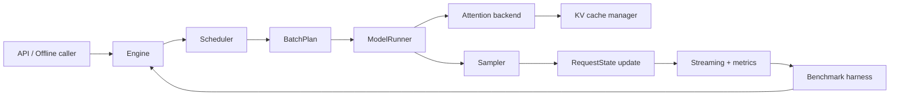

# nano-serve

[English](README.md) | 中文

`nano-serve` 是一个学习型 LLM serving engine。目标是从最朴素的
PyTorch forwarding 开始，逐步加入现代推理引擎里的关键能力：KV cache、
batching、paged attention、chunked prefill、prefix cache、speculative
decoding、TileLang kernel、分布式 serving、PD 分离，最后探索
Attention-FFN disaggregation。

这个仓库从第一天开始就是 benchmark-first。每个 feature 都要回答：

- 它解决了什么瓶颈？
- 哪些 workload 会受益？
- 哪些 workload 可能变差？
- TTFT、TPOT、E2E latency、throughput、MFU、SM activity、HBM bandwidth、
  KV 显存占用分别发生了什么变化？

## 当前状态

当前仓库已经初始化为 agent 友好的项目骨架。大部分模块目前还是接口、stub
和设计文档。后续实现应该严格跟随下面的 roadmap，不要直接跳到复杂 kernel
或分布式 serving。

## 模型和数据集资产

第一阶段只支持一个模型：`Qwen/Qwen3.5-4B`。

模型和 benchmark 数据集都很大，不能进 git。用环境变量告诉项目本地资产路径：

```bash
export NANO_SERVE_MODEL_PATH=$PWD/.nano-serve/models/qwen3.5-4b
export NANO_SERVE_DATASET_PATH=$PWD/.nano-serve/datasets/sharegpt/ShareGPT_V3_unfiltered_cleaned_split.json
```

可选覆盖项：

```bash
export NANO_SERVE_MODEL_ID=Qwen/Qwen3.5-4B
export NANO_SERVE_DATASET_REPO_ID=anon8231489123/ShareGPT_Vicuna_unfiltered
export NANO_SERVE_DATASET_FILENAME=ShareGPT_V3_unfiltered_cleaned_split.json
```

下载资产：

```bash
PYTHONPATH=src python3 scripts/download_assets.py
```

运行不加载模型权重的 Phase 0 本地 smoke：

```bash
nano-serve assets env
nano-serve phase0-smoke --num-samples 8
nano-serve bench dummy --num-samples 4
nano-serve bench compare runs/phase0/<base-run-id> runs/phase0/<candidate-run-id>
```

推荐使用的 `.nano-serve/`、`models/`、`datasets/`、`data/` 目录都已经
gitignore。下载脚本也会在下载前检查仓库内路径是否被 git ignore，避免大文件
被误提交。

## 平台支持

`nano-serve` 面向两个运行环境：

- macOS Apple Silicon：CPU-only 本地 agent loop 开发、资产检查、数据集读取、
  日志、报告生成和非 CUDA smoke test。
- Linux NVIDIA H20/H100：CUDA 模型加载、benchmark/profiling，以及后续
  TileLang/custom-kernel 工作。

共享基础设施不能强依赖 CUDA-only 包。运行时设备选择规则是：当
`torch.cuda.is_available()` 为 true 时使用 `cuda`，否则使用 `cpu`。macOS
不需要 MPS 路径。TileLang/custom kernel 可以是 Linux/NVIDIA-only，但必须保留
torch fallback 或干净的 skip path。

## 架构草图



## 设计原则

- 从 day 0 开始做 benchmark。
- 每个 feature 都必须有 config flag。
- 每个 feature 都要有 correctness test、microbenchmark 和 end-to-end
  benchmark。
- 先用简单 PyTorch kernel，再把明确的瓶颈逐步替换成 TileLang kernel。
- 第一阶段只支持 `Qwen/Qwen3.5-4B`。
- 用 Hugging Face 做 correctness oracle，不把它当作隐藏的 serving engine。
- 优先理解和 ablation，不急着追求性能数字。
- 只有当本地 milestone 足够成熟时，再和 vLLM、SGLang、TensorRT-LLM、
  TileRT 对比。

## 仓库结构

```text
src/nano_serve/
  api/                 OpenAI-compatible API 和 offline Python API
  engine/              Engine loop、request state、batch plan、config
  scheduler/           single/static/continuous/chunked-prefill scheduler
  kv_cache/            KV cache interface、contiguous cache、paged cache
  model/               最小 model loader、Llama/Qwen-style runner
  attention/           Torch 和 paged attention backend
  kernels/             TileLang kernel 和 torch reference op
  sampling/            greedy、top-k/top-p、penalties、beam search
  speculative/         draft/verify、n-gram、Medusa、EAGLE 实验
  distributed/         worker、RPC、TP、PP、DP、PD、AF prototype
  benchmark/           workload、metrics、profiling、report、compare
  observability/       events、tracing、Prometheus、dashboard hook
docs/
  architecture.md
  benchmarking.md
  roadmap.md
  references.md
  features/            每个 feature 一份设计文档
tests/
scripts/
```

## 指标

Request-level metrics：

- `TTFT`：从请求到达到第一个输出 token 的时间。
- `TPOT` / `ITL`：第一个输出 token 之后的平均 token 间隔。
- `E2E`：从请求到达到最后一个输出 token 的总时间。
- `queue_ms`、`prefill_ms`、`decode_ms`、`input_tokens`、`output_tokens`。

System-level metrics：

- output tokens/s、total tokens/s、requests/s。
- goodput under TTFT/TPOT SLO。
- GPU memory peak、KV utilization、KV fragmentation。
- prefix cache hit tokens 和 hit rate。
- speculative decoding acceptance length 和 target calls per output token。
- prefill/decode MFU、SM Active / SM Activity、HBM bandwidth utilization。
- 平台字段：OS、machine、Python version、torch version（如果已安装）、
  detected device backend，以及可用时的 CUDA device 信息。

默认 TPOT 公式：

```text
TPOT = (last_token_ts - first_token_ts) / (num_output_tokens - 1)
```

尽量分开报告 prefill 和 decode。prefill 往往更 compute-bound，decode 往往更
memory-bound。

## Roadmap

### Phase 0: Infrastructure

- [x] Config system and feature flags.
- [x] JSONL event logger.
- [x] Request-level and iteration-level metrics.
- [x] Benchmark report generator.
- [x] Benchmark comparison tool.
- [x] NVTX range helper.
- [x] Qwen3.5-4B and ShareGPT asset downloader.
- [x] ShareGPT dataset loading fixture.
- [x] Phase 0 local smoke CLI and benchmark artifacts.
- [x] macOS CPU-only and Linux NVIDIA CUDA platform policy.

### Phase 1: Naive PyTorch Engine

- [x] Load `Qwen/Qwen3.5-4B` from `safetensors`.
- [x] Implement tokenizer wrapper.
- [x] Implement PyTorch forward.
- [x] Implement greedy decoding.
- [x] Implement temperature/top-k/top-p sampling.
- [x] Add streaming output callback.
- [x] Add Hugging Face correctness oracle interface.
- [x] Validate logits against Hugging Face.
- [x] Benchmark single-request TTFT/TPOT/E2E.

### Phase 2: KV Cache

- [x] Split execution into prefill and decode.
- [x] Implement contiguous KV cache.
- [x] Implement per-layer K/V cache tensors.
- [x] Implement RoPE position handling for cached decode.
- [x] Validate cached decode logits against full forward.
- [x] Benchmark no-cache vs KV-cache decoding.
- [x] Record KV memory usage.

### Phase 3: Static Batching

- [x] Implement batched prefill.
- [x] Implement batched decode.
- [x] Implement per-request stop condition.
- [x] Support inactive finished slots.
- [x] Measure padding waste.
- [x] Measure inactive slot waste.
- [x] Benchmark equal-length vs mixed-length batches.

### Phase 4: Continuous Batching

- [x] Implement `RequestState` state machine.
- [x] Implement waiting/running/finished queues.
- [x] Implement `Engine.step()`.
- [x] Implement FCFS scheduler.
- [x] Implement `max_num_seqs` and `max_num_batched_tokens`.
- [x] Allow new requests to enter during decode.
- [x] Allow finished requests to leave immediately.
- [x] Add decode-first and prefill-first policies.
- [x] Benchmark static batching vs continuous batching.
- [ ] Add vLLM and SGLang baseline benchmark scripts once the local engine can
      run comparable workloads.

### Phase 5: Paged KV Cache

- [x] Implement fixed-size KV blocks.
- [x] Implement free block allocator.
- [x] Implement block table.
- [x] Implement append-token block allocation.
- [x] Implement block release.
- [x] Track KV internal fragmentation.
- [x] Implement OOM behavior.
- [x] Add randomized allocator tests.

### Phase 6: Paged Attention Reference

- [x] Implement torch gather-based paged attention.
- [x] Validate against contiguous KV attention.
- [x] Benchmark gather overhead.
- [x] Sweep block size and context length.
- [x] Use this backend as correctness reference for custom kernels.

### Phase 7: TileLang Kernels

- [x] Implement TileLang RMSNorm.
- [x] Implement TileLang RoPE.
- [x] Implement TileLang SiLU-mul.
- [x] Implement TileLang sampling helper.
- [x] Implement TileLang paged decode attention.
- [x] Compare TileLang paged attention with torch gather fallback.
- [ ] Profile with Nsight Compute.
- [ ] Record SM activity and HBM bandwidth.

### Phase 8: Chunked Prefill

- [x] Add `prefill_cursor` to `RequestState`.
- [x] Split long prefill into chunks.
- [x] Implement max prefill chunk size.
- [x] Implement mixed prefill/decode batch plan.
- [x] Implement decode-maximal scheduling.
- [x] Benchmark long-prefill interference.
- [x] Plot chunk size vs TTFT/TPOT tradeoff.

### Phase 9: Prefix Cache / Radix Cache

- [ ] Implement block-level prefix hash cache.
- [ ] Implement prefix cache ref counting.
- [ ] Implement LRU eviction.
- [ ] Implement copy-on-write for shared blocks.
- [ ] Implement radix tree prefix cache.
- [ ] Track prefix cache hit tokens.
- [ ] Benchmark shared system prompt and multi-turn chat workloads.

### Phase 10: CPU/GPU Overlap and Graphs

- [ ] Add tokenizer worker.
- [ ] Add asynchronous scheduler preparation.
- [ ] Add double-buffered batch metadata.
- [ ] Add `torch.compile` experiment.
- [ ] Add CUDA graph experiment for decode.
- [ ] Add shape buckets.
- [ ] Profile CPU overhead with Nsight Systems.

### Phase 11: Speculative Decoding

- [ ] Implement greedy draft-model speculative decoding.
- [ ] Implement target verification.
- [ ] Implement acceptance/rejection logic.
- [ ] Update KV cache for accepted tokens.
- [ ] Add acceptance length metric.
- [ ] Implement sampling speculative decoding.
- [ ] Implement batched speculative decoding.
- [ ] Add n-gram speculation.
- [ ] Add Medusa-style and EAGLE-style experimental interfaces.

### Phase 12: Quantization and Advanced Serving Features

- [ ] Implement FP8/INT8 KV cache experiment.
- [ ] Implement weight-only INT8 experiment.
- [ ] Implement weight-only INT4 experiment.
- [ ] Add LoRA and multi-LoRA batching.
- [ ] Add grammar/structured output decoding.
- [ ] Add quality/correctness regression tests.

### Phase 13: Single-Node Distributed

- [ ] Implement data-parallel replicas.
- [ ] Implement tensor parallelism.
- [ ] Implement NCCL all-reduce.
- [ ] Shard attention heads, MLP weights, and KV cache where needed.
- [ ] Implement pipeline parallelism.
- [ ] Implement expert parallelism for MoE.
- [ ] Benchmark TP/PP/EP scaling.

### Phase 14: Multi-Node Distributed

- [ ] Add multi-node worker launcher.
- [ ] Add rank/topology config.
- [ ] Add distributed metric collection.
- [ ] Add router process.
- [ ] Add worker heartbeat and basic failure detection.
- [ ] Benchmark cross-node TP/PP and network overhead.

### Phase 15: Prefill-Decode Disaggregation

- [ ] Implement `PrefillWorker`.
- [ ] Implement `DecodeWorker`.
- [ ] Implement `KVTransferManager`.
- [ ] Implement `KVLocationRegistry`.
- [ ] Implement same-node and cross-node KV transfer.
- [ ] Implement TTFT-aware prefill scheduling.
- [ ] Implement TPOT-aware decode scheduling.
- [ ] Sweep prefill/decode pool ratios.
- [ ] Benchmark goodput under TTFT/TPOT SLO.

### Phase 16: Attention-FFN Disaggregation

- [ ] Build AFD simulator first.
- [ ] Model attention latency, FFN latency, and activation transfer cost.
- [ ] Sweep Attention/FFN ratio.
- [ ] Implement single-layer A/F split prototype.
- [ ] Validate correctness against colocated execution.
- [ ] Implement MoE-first AFD prototype.
- [ ] Measure activation traffic, FFN utilization, and pipeline bubbles.

### Phase 17: Production-Like Observability

- [ ] Add Prometheus metrics.
- [ ] Add request tracing.
- [ ] Add per-iteration timeline dump.
- [ ] Add flamegraph/nsys helper.
- [ ] Add dashboard.
- [ ] Add benchmark artifact archive.
- [ ] Add regression benchmark CI.

## 推荐实现顺序

1. 搭 benchmark infrastructure。
2. 实现 torch single-request forwarding。
3. 加 KV cache 和 prefill/decode split。
4. 先做 static batching，再做 continuous batching。
5. 加 paged KV cache 和 torch paged-attention reference。
6. 加 TileLang paged decode attention。
7. 加 chunked prefill 和 prefix cache。
8. 加 speculative decoding。
9. 加 distributed serving、PD disaggregation，再探索 AF disaggregation。

## 设计文档

从这些文档开始：

- [Architecture](docs/architecture.md)
- [Benchmarking](docs/benchmarking.md)
- [Roadmap](docs/roadmap.md)
- [References](docs/references.md)
- [Feature design index](docs/features/README.md)

Roadmap 里的每个 feature 都在 `docs/features/` 下有对应设计文档。实现 feature
前必须先新增或更新对应设计文档。
